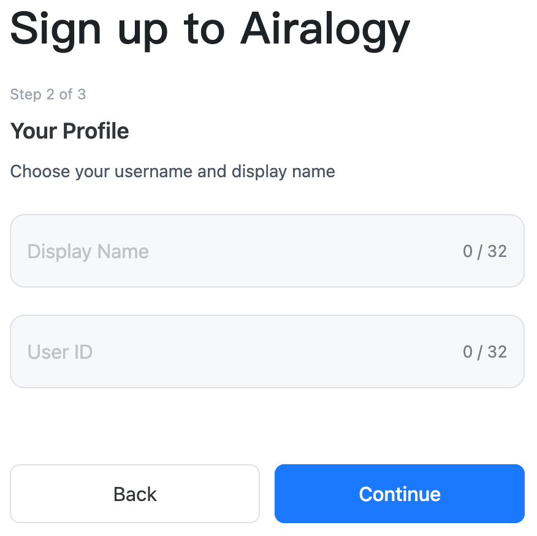
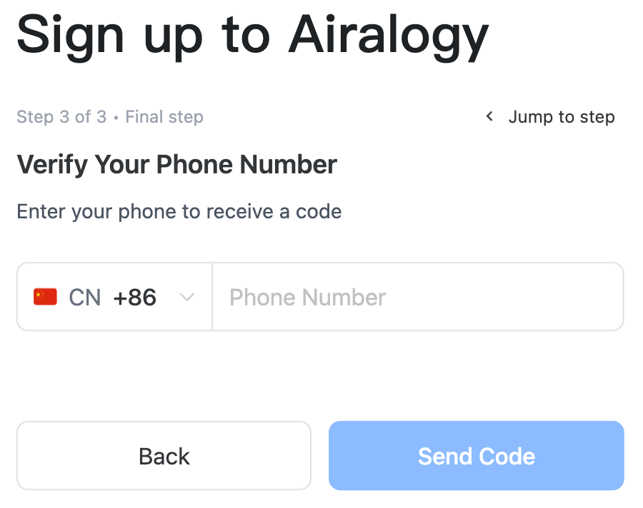
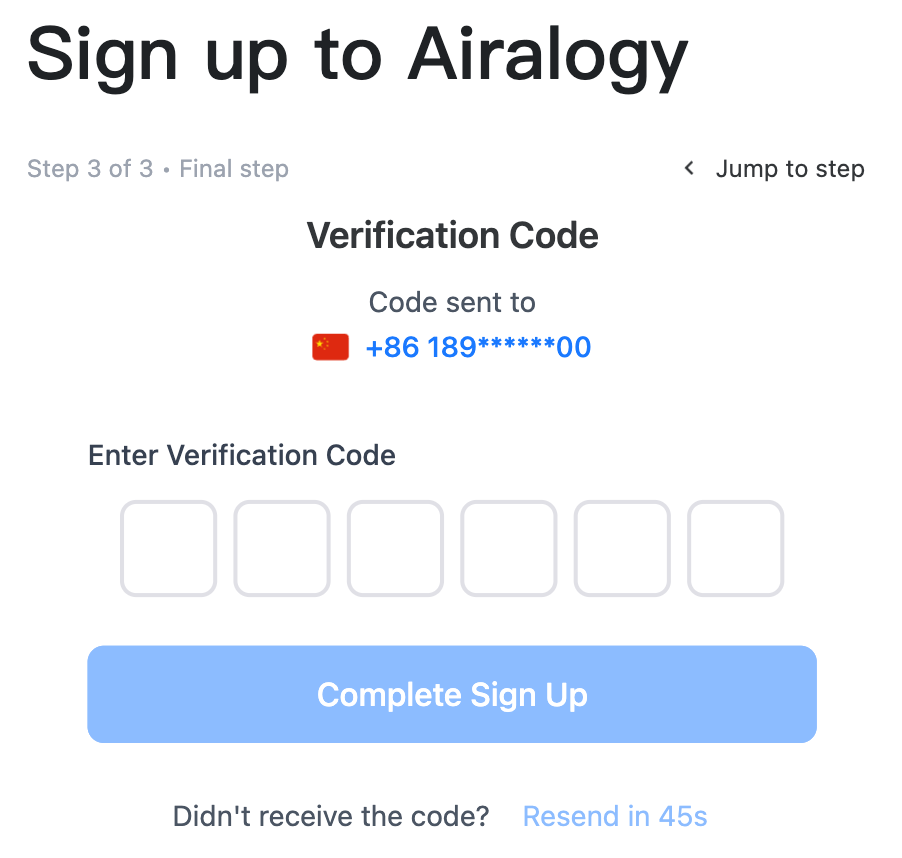
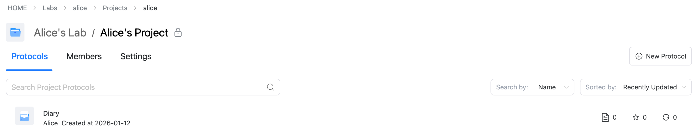

# Airalogy Quick Start Guide

## Create an Airalogy Account

1. Visit the official Airalogy website.
2. Click the **“Sign Up”** button in the top-right corner. (After you register, you can log in via the **“Log In”** button.)
   
3. Follow the on-screen instructions step by step to complete registration.

   1. Enter your email address and set a password. We recommend using a strong password to protect your account.
   
   2. Set your username and User ID.
      Note: Your username can be changed later, but your **User ID is your unique identifier on the platform and cannot be changed after registration. Please choose a User ID you are fully satisfied with.** 
   3. Enter your phone number and verify it via an SMS code.
      Note: Airalogy supports phone-number registration in 100+ countries and regions. Please select the correct country code when registering. **For users in mainland China, please select “+86”.**
      

      After you click **“Send Code”**, the verification code will be sent to the phone number you provided. If you do not receive it, please verify that the phone number is correct and try again. In some cases, SMS delivery may be delayed by your carrier. The message may also be filtered as spam—please check your spam folder if applicable.

      You will receive an SMS starting with `【渊楠】`, with content similar to `【渊楠】Your verification code is 123456. Do not share it with anyone!`:
      

      Enter the 6-digit code into the verification field on the registration page:
      

      Click **“Complete Sign Up”** to finish registration.
   4. After registration, you can log in to Airalogy in two ways: **phone number login** or **email login**.

## Log in to Airalogy

As described in the **“Create an Airalogy Account”** section, you can log in to Airalogy using either your phone number or your email address.

## Get Started After Registration

Airalogy uses a three-level structure:

**Lab > Project > Protocol**

A **Lab** is the highest-level organizational unit, and one lab can contain multiple projects.

A **Project** is used to manage a specific research effort. Each project can contain multiple protocols. Each **Protocol** corresponds to a specific data collection/usage plan.

To help you get started quickly, once you register a valid Airalogy account (which corresponds to a new User ID, e.g., `alice`), the system will automatically create the following for you:

* A default lab:

  * The lab ID is the same as your User ID (so the lab ID is `alice`)
  * The lab name is `<Your User ID>'s Lab` (e.g., `alice's Lab`)
  * **Like User IDs, Lab IDs cannot be changed after creation**, while the lab name can be changed anytime in lab settings.
* Under that default lab, a default project:

  * The project ID is also the same as your User ID (so the project ID is `alice`)
  * The project name is `<Your User ID>'s Project` (e.g., `alice's Project`)
  * Similarly, **project IDs cannot be changed after creation**, while the project name can be changed anytime in project settings.

There are two types of projects: **private** and **public** (see the [Access Control](./access-control.md) section for details on permissions).

* **Private projects:** Protocols and records are visible only to project members.
* **Public projects:** Protocols and records can be visible to all users depending on configuration.

The default project created for your account is a **private project**. If you do not add any additional members, it will be visible only to you.

Under this default project, the system also creates an example “diary” protocol:

* Protocol ID: `diary`
* Protocol name: `Daily`



This protocol demonstrates the most basic way to use Airalogy: you can create an Airalogy protocol based on the [Airalogy Protocol Syntax](https://airalogy.github.io/airalogy/zh/syntax/). In a protocol, you can design your workflow using a Markdown-like language developed by Airalogy—**Airalogy Markdown (AIMD)**.

In short, AIMD allows you to insert custom data fields anywhere within Markdown content and specify each field’s data type. Airalogy will automatically parse the AIMD and generate a data-entry form UI. Users can fill in the form and save the data; all submitted data is automatically stored in Airalogy’s database.

For example, the AIMD source of the **Daily** protocol is shown below:

```aimd
# Diary

Recorder's Name: {{var|name: UserName}}

Recording Time: {{var|time: CurrentTime}}

Content:

{{var|content: AiralogyMarkdown}}
```

In this protocol, three data fields are defined: `name`, `time`, and `content`. Their data types are set to `UserName` (the username of the currently logged-in user), `CurrentTime` (the current time), and `AiralogyMarkdown` (Airalogy Markdown text), respectively. When you open the protocol to record data, Airalogy automatically parses the AIMD and renders it as a form interface for data entry and saving:


You may also notice that on the left side of the recording interface, Airalogy provides **Aira**, the world’s first general-purpose large model for all disciplines. Aira can read the protocol content and recorded data on the right in real time. You can ask questions about the protocol and/or the recorded content at any time—Aira will analyze them and provide relevant answers and suggestions to help you better understand and use your protocols and records.
